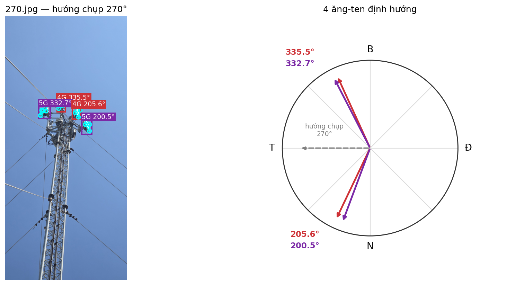

# Phát hiện thiết bị và ước lượng góc phương vị anten trạm BTS

Hệ thống thị giác máy tính kết hợp **YOLO26 Detection**, **YOLO26-Pose** và hình học camera để nhận diện thiết bị viễn thông, xác định bốn góc mặt trước anten và ước lượng góc phương vị từ ảnh khảo sát tại trạm BTS.

**Tác giả:** Huỳnh Nguyên Quân — MSSV 22200130  
**Đơn vị:** Khoa Điện tử – Viễn thông, Trường Đại học Khoa học Tự nhiên, ĐHQG TP.HCM  
**Năm thực hiện:** 2026

> Tài liệu này giúp người mới nắm được bài toán, luồng xử lý, dữ liệu đầu vào, kết quả đầu ra và cách chạy lại dự án. Chi tiết toàn bộ quá trình thử nghiệm, các phương án đã loại bỏ và lập luận chọn mô hình được trình bày trong [README_QUY_TRINH.md](README_QUY_TRINH.md).

---

## 1. Dự án giải quyết bài toán gì?

Ảnh chụp tại trạm BTS thường chỉ cho thấy thiết bị đang nằm ở đâu trong ảnh. Để kiểm tra hướng lắp đặt anten, hệ thống còn phải xác định **mặt trước anten đang quay về hướng nào so với hướng Bắc**.

Dự án nhận các đầu vào sau:

| Đầu vào | Vai trò |
|---|---|
| Ảnh khảo sát trạm BTS | Chứa anten và các thiết bị viễn thông cần nhận diện |
| Trọng số YOLO26 Detection | Phân loại thiết bị và xác định khung bao |
| Trọng số YOLO26-Pose | Xác định bốn keypoint trên mặt trước anten |
| `heading` của ảnh | Hướng camera khi chụp, tính theo độ từ hướng Bắc |
| Thông tin tiêu cự | Ưu tiên đọc từ EXIF; nếu thiếu sẽ dùng FOV hoặc giá trị mặc định |

Đầu ra của mỗi thiết bị gồm:

- loại thiết bị và khung bao;
- trạng thái có hoặc không ghép được bốn keypoint;
- góc lệch tương đối giữa anten và camera (`az_rel`);
- góc phương vị tuyệt đối (`true_az`);
- sai số tái chiếu RMS;
- các cờ cảnh báo nghiệm nhập nhằng hoặc nghiệm đã được lật bởi bộ kiểm tra hình học.

Công thức chuyển từ góc tương đối sang góc phương vị thực:

```text
true_az = (heading - az_rel + azimuth_offset) mod 360
```

Trong đó, `heading` là dữ liệu bắt buộc lấy từ bên ngoài ảnh. Một ảnh đơn lẻ không thể tự cho biết camera đang quay về hướng Bắc, Đông, Nam hay Tây.

---

## 2. Luồng xử lý của hệ thống

```text
Ảnh khảo sát + heading
        │
        ├── YOLO26 Detection
        │      └── lớp thiết bị + bounding box
        │
        ├── YOLO26-Pose
        │      └── bounding box + 4 keypoint: TL → TR → BR → BL
        │
        └── Ghép Detection ↔ Pose
               ├── Hungarian matching 1–1
               ├── ngưỡng IoU
               └── kiểm tra tâm khung bao
                        │
                        ▼
              Xác định ma trận nội tại camera
               EXIF f35 → FOV → f35 mặc định
                        │
                        ▼
              IPPE-PnP cho vật thể phẳng
               ├── sinh các nghiệm khả dĩ
               ├── tinh chỉnh Levenberg–Marquardt
               ├── so sánh RMS tái chiếu
               └── Tilt-Sanity Guard
                        │
                        ▼
              Pháp tuyến mặt trước anten
                        │
                        ▼
              az_rel → true_az
```

Hai mô hình được tách riêng vì chúng đảm nhiệm hai việc khác nhau:

- **Detection** trả lời: “Đây là thiết bị gì và nằm ở đâu?”
- **Pose** trả lời: “Bốn góc mặt trước của thiết bị nằm ở đâu?”

Kết quả của hai mô hình được ghép 1–1 bằng thuật toán Hungarian, kết hợp IoU và điều kiện tâm khung bao, nhằm hạn chế việc một bộ keypoint bị gán cho nhiều anten nằm gần nhau.

---

## 3. Mô hình và lớp đối tượng

### 3.1. Nhận diện thiết bị

Sáu mô hình được huấn luyện và đối chiếu trên cùng bộ dữ liệu:

- YOLO26n;
- YOLO26s;
- YOLO26m;
- YOLO26l;
- YOLO26x;
- Mamba-YOLO-B.

Các lớp nhận diện:

```text
anten-4G, anten-5G, none, rrh, rru, viba
```

Mô hình được chọn cho pipeline cuối là **YOLO26m**, dựa trên sự cân bằng giữa độ chính xác và chi phí tính toán. Theo kết quả đo lưu trong repository, YOLO26m đạt khoảng **19,42 ms/ảnh, tương đương 51,5 FPS trên GPU Tesla T4**. Con số này dùng để so sánh trong cùng môi trường thử nghiệm, không phải cam kết tốc độ trên mọi thiết bị.

### 3.2. Xác định keypoint

Hai biến thể pose được huấn luyện:

- YOLO26m-Pose;
- YOLO26l-Pose.

Pipeline cuối sử dụng **YOLO26m-Pose**. Mỗi đối tượng có bốn keypoint theo đúng thứ tự:

```text
0: Top-Left → 1: Top-Right → 2: Bottom-Right → 3: Bottom-Left
```

Thứ tự này phải được giữ nhất quán từ gán nhãn, huấn luyện đến PnP. Chỉ cần xoay sai thứ tự một vị trí, nghiệm vẫn có thể có RMS nhỏ nhưng góc phương vị bị sai rất lớn.

---

## 4. Kết quả minh họa

Ảnh dưới đây minh họa kết quả trên ảnh có hướng chụp `270°`. Hệ thống phát hiện bốn anten, xác định keypoint và biểu diễn hướng anten trên hệ trục phương vị.



Các tệp kết quả mẫu nằm tại:

```text
Data_Result_azimuth/04-predictions/azimuth_results/
├── azimuth_90.png
├── azimuth_180.png
├── azimuth_270.png
└── azimuth_ketqua.csv
```

Trong ba ảnh mẫu, pipeline tính được góc cho 8 anten với RMS tái chiếu khoảng `0,54–2,85 px`. RMS nhỏ chỉ cho biết nghiệm khớp tốt với bốn keypoint trên mặt phẳng ảnh; nó **không trực tiếp chứng minh góc phương vị là đúng**. Sai số góc vẫn phụ thuộc mạnh vào chất lượng keypoint, thứ tự keypoint, tỷ lệ hình học tham chiếu và độ chính xác của `heading`.

---

## 5. Cấu trúc repository

```text
KLTN_QUAN/
├── config/
│   ├── args_yolo26m.yaml                  # Cấu hình huấn luyện YOLO26m-Pose
│   └── args_yolo26l.yaml                  # Cấu hình huấn luyện YOLO26l-Pose
│
├── Data_Result_azimuth/
│   ├── 01-raw/                            # Ảnh khảo sát mẫu: 90, 180, 270 độ
│   └── 04-predictions/
│       ├── azimuth_results/               # Ảnh và CSV kết quả phương vị
│       └── pose_results/                  # Kết quả đánh giá mô hình pose
│
├── docs/
│   └── KLTN_22200130_HuynhNguyenQuan.docx
│
├── entrypoint/
│   └── inference.py                       # Bản chạy độc lập, có cấu hình ở cuối tệp
│
├── KQ_2_MODEL_POSE/                       # Kết quả huấn luyện và đánh giá 2 mô hình pose
├── KQ_6_MODEL_DETECTION/                  # Kết quả 6 mô hình detection và đo tốc độ
│
├── Source_code/
│   ├── TIEN_XU_LI_DATA/                   # Notebook chuẩn bị dữ liệu detection và pose
│   ├── TRAIN MODEL DETECTION AND POSE/    # Notebook huấn luyện trên Kaggle
│   └── TINH_KET_QUA_GOC_PHUONG_VI/        # Notebook và mã nguồn tính azimuth
│
├── src/
│   └── pipelines/
│       ├── feature_eng_pipeline.py        # Chia dữ liệu pose và tạo dataset.yaml
│       └── inference_pipeline.py          # Pipeline Detection → Pose → PnP → Azimuth
│
├── Dockerfile
├── docker-compose.yml
├── env.yaml                               # Môi trường Conda cho chạy chính
├── env-dev.yaml                           # Môi trường Conda cho phát triển
├── Makefile
├── requirements.txt
├── README.md
└── README_QUY_TRINH.md
```

Thư mục `.git/` không được mô tả trong cây trên vì đây là dữ liệu nội bộ của Git, không phải thành phần nghiệp vụ của dự án.

---

## 6. Cài đặt môi trường

### 6.1. Cài bằng `venv` và `pip`

Khuyến nghị dùng Python 3.10.

```bash
python -m venv .venv
```

Kích hoạt môi trường:

```bash
# Windows
.venv\Scripts\activate

# Linux / macOS
source .venv/bin/activate
```

Cài thư viện:

```bash
python -m pip install --upgrade pip
pip install -r requirements.txt
```

### 6.2. Cài bằng Conda

```bash
conda env create -f env.yaml
conda activate telecom_azimuth_prod
```

Môi trường phát triển có thêm Jupyter, pytest, black và flake8:

```bash
conda env create -f env-dev.yaml
conda activate telecom_azimuth_dev
```

### 6.3. Trọng số mô hình

Pipeline cần hai tệp trọng số đã huấn luyện:

```text
YOLO26m Detection best.pt
YOLO26m-Pose best.pt
```

Các tệp `*.pt` bị loại khỏi Git theo `.gitignore`, do đó người dùng phải tự cung cấp hai trọng số này. Có thể tạo thư mục cục bộ như sau:

```text
weights/
├── yolo26m_detection_best.pt
└── yolo26m_pose_best.pt
```

Thư mục này chỉ là quy ước chạy cục bộ; mã nguồn chấp nhận trọng số ở bất kỳ vị trí nào miễn đường dẫn truyền vào là đúng.

---

## 7. Chạy thử trên bộ ảnh mẫu

### 7.1. Cách khuyến nghị: gọi pipeline từ Python

Tạo tệp `run_demo.py` tại thư mục gốc:

```python
from pathlib import Path

import pandas as pd

from src.pipelines.inference_pipeline import run_folder

ROOT = Path(__file__).resolve().parent

results = run_folder(
    folder=str(ROOT / "Data_Result_azimuth" / "01-raw"),
    pose_weights=str(ROOT / "weights" / "yolo26m_pose_best.pt"),
    det_weights=str(ROOT / "weights" / "yolo26m_detection_best.pt"),
    headings={
        "90.jpg": 90.0,
        "180.jpg": 180.0,
        "270.jpg": 270.0,
    },
    azimuth_offset=0.0,
    imgsz=640,
    pose_conf=0.20,
    det_conf=0.55,
    iou_match=0.30,
    with_mc=False,
    strict_match=True,
)

output = ROOT / "Data_Result_azimuth" / "04-predictions" / "azimuth_results"
output.mkdir(parents=True, exist_ok=True)
pd.DataFrame(results).to_csv(output / "demo_results.csv", index=False, encoding="utf-8-sig")
```

Chạy:

```bash
python run_demo.py
```

Hàm `run_folder()` in bảng kết quả ra terminal và trả về `list[dict]`, mỗi phần tử tương ứng một thiết bị được phát hiện.

### 7.2. Chạy `entrypoint/inference.py`

```bash
python entrypoint/inference.py
```

Lưu ý: cuối tệp `entrypoint/inference.py` hiện còn các đường dẫn tuyệt đối dạng `E:\...` từ máy của tác giả. Trước khi chạy trên máy khác, cần sửa bốn biến:

```python
FOLDER = "duong/dan/thu_muc_anh"
POSE = "duong/dan/yolo26m_pose_best.pt"
DET = "duong/dan/yolo26m_detection_best.pt"
HEADINGS = {"ten_anh.jpg": heading_do}
```

Cách ở mục 7.1 được khuyến nghị hơn vì không phải sửa mã nguồn pipeline.

### 7.3. Tạo ảnh trực quan giống kết quả mẫu

Mở notebook:

```text
Source_code/TINH_KET_QUA_GOC_PHUONG_VI/azimuth_inference.ipynb
```

Notebook này thực hiện đầy đủ quá trình suy luận, lưu bảng CSV và vẽ ảnh minh họa hướng anten.

---

## 8. Ý nghĩa các trường đầu ra

| Trường | Ý nghĩa |
|---|---|
| `image` | Tên ảnh đầu vào |
| `name` | Lớp thiết bị do mô hình Detection dự đoán |
| `box` | Bounding box dạng `[x1, y1, x2, y2]` |
| `has_pose` | Có ghép được bộ keypoint hợp lệ hay không |
| `heading` | Hướng camera khi chụp |
| `az_rel` | Góc anten tương đối so với trục quang camera |
| `true_az` | Góc phương vị sau khi kết hợp `heading` và offset |
| `rms_before` | RMS của nghiệm IPPE trước tinh chỉnh LM |
| `rms` | RMS sau tinh chỉnh LM |
| `ambiguous` | Hai nghiệm khả dĩ có chất lượng gần nhau |
| `flipped` | Bộ kiểm tra tilt đã chuyển sang nghiệm còn lại |
| `mc_std` | Độ nhạy khi gây nhiễu keypoint; chỉ dùng làm thông tin cảnh báo |

Nếu `has_pose=False`, thiết bị vẫn được Detection nhận diện nhưng không có bộ bốn keypoint phù hợp để giải PnP, vì vậy không thể tính azimuth.

---

## 9. Chuẩn bị dữ liệu và huấn luyện lại

### 9.1. Detection

Quy trình dữ liệu:

```text
COCO từ Roboflow
    → làm sạch annotation
    → chuyển COCO sang YOLO
    → chia ảnh gốc theo tỉ lệ 70/20/10
    → chỉ tăng cường tập train
    → huấn luyện 6 mô hình
    → chọn mô hình trên validation
    → báo cáo cuối trên test
```

Notebook:

```text
Source_code/TIEN_XU_LI_DATA/preprocess_detection_dataset.ipynb
Source_code/TRAIN MODEL DETECTION AND POSE/detection/
```

### 9.2. Pose

Quy trình dữ liệu:

```text
Ảnh và nhãn bốn keypoint
    → kiểm tra thứ tự TL → TR → BR → BL
    → chia 80/10/10 theo ảnh
    → tạo dataset.yaml với kpt_shape: [4, 3]
    → huấn luyện YOLO26m-Pose và YOLO26l-Pose
    → chọn mô hình trên validation
```

Có thể chạy bước chia dữ liệu pose bằng:

```bash
python src/pipelines/feature_eng_pipeline.py
```

Tệp này hiện chứa đường dẫn Windows tuyệt đối ở hai biến `SRC` và `OUT`. Cần sửa chúng trước khi chạy.

Notebook:

```text
Source_code/TIEN_XU_LI_DATA/preprocess_pose_dataset.ipynb
Source_code/TRAIN MODEL DETECTION AND POSE/pose/
```

Kết quả huấn luyện được lưu trong:

```text
KQ_6_MODEL_DETECTION/
KQ_2_MODEL_POSE/
Data_Result_azimuth/04-predictions/pose_results/
```

---

## 10. Các giả định và giới hạn cần biết

1. **Không có `heading` thì không có azimuth tuyệt đối.** Hệ thống chỉ suy ra hướng anten tương đối với camera.
2. **Bốn keypoint phải đúng thứ tự.** RMS nhỏ không đủ để phát hiện một bộ keypoint bị xoay thứ tự.
3. **Tỷ lệ cao/rộng quan trọng hơn kích thước tuyệt đối.** Gán sai lớp có thể làm dùng sai mô hình hình học và gây sai số góc lớn.
4. **Mô hình camera đang là xấp xỉ.** Hệ thống ưu tiên tiêu cự tương đương 35 mm từ EXIF và giả định tâm chính gần tâm ảnh, pixel vuông, méo ảnh bằng 0.
5. **Ảnh độ phân giải thấp làm keypoint nhiễu.** Đây là một trong các nguồn sai số chính của pipeline.
6. **RMS tái chiếu không phải sai số azimuth.** RMS chỉ đo độ khớp của nghiệm trên mặt phẳng ảnh.
7. **`azimuth_offset` chưa phải hằng số phổ quát.** Nếu có góc đo thực tế tại trạm, nên hiệu chuẩn lại bằng `calibrate_offset()`.
8. **Pipeline chỉ báo cáo azimuth.** Giá trị `tilt` trong mã là góc hình học giữa mặt anten và camera, không phải downtilt cơ khí của anten.

---

## 11. Tái lập kết quả

Để tái lập đúng số liệu trong khóa luận, cần giữ đồng nhất:

- cách chia dữ liệu và random seed;
- nhãn keypoint đúng phiên bản;
- `imgsz=640` ở huấn luyện và suy luận;
- trọng số `best.pt` đã được chọn trên tập validation;
- phiên bản thư viện đã dùng khi huấn luyện;
- cùng ngưỡng `pose_conf`, `det_conf` và `iou_match`;
- cùng quy ước `heading` và `azimuth_offset`.

`requirements.txt` sử dụng điều kiện phiên bản tương đối rộng để thuận tiện cài đặt. Khi cần tái lập số liệu đến chữ số thập phân, hãy đối chiếu thêm các tệp `args.yaml` trong thư mục kết quả và phần ghi chép môi trường trong [README_QUY_TRINH.md](README_QUY_TRINH.md).

---

## 12. Docker và CI

Repository có sẵn `Dockerfile`, `docker-compose.yml`, `Makefile` và `.gitlab-ci.yml` để hỗ trợ đóng gói, kiểm tra cú pháp và lint.

Các lệnh Makefile:

```bash
make install
make inference
make clean
make docker-build
make docker-run
```

Trước khi dùng Docker, cần lưu ý:

- mount đúng thư mục dữ liệu thực tế là `Data_Result_azimuth/`;
- mount hoặc copy hai tệp trọng số `best.pt`;
- thay các đường dẫn tuyệt đối Windows trong entrypoint bằng đường dẫn trong container.

Vì vậy, cấu hình Docker hiện nên được xem là khung triển khai, chưa phải lệnh chạy một bước trên mọi máy.

---

## 13. Tài liệu liên quan

- [Quy trình nghiên cứu và các quyết định kỹ thuật](README_QUY_TRINH.md)
- [Khóa luận tốt nghiệp](docs/KLTN_22200130_HuynhNguyenQuan.docx)
- [Pipeline suy luận chính](src/pipelines/inference_pipeline.py)
- [Mã nguồn tính azimuth có chú thích](Source_code/TINH_KET_QUA_GOC_PHUONG_VI/azimuth_optimized.py)
- [Notebook suy luận và trực quan hóa](Source_code/TINH_KET_QUA_GOC_PHUONG_VI/azimuth_inference.ipynb)
- [Cấu hình YOLO26m-Pose](config/args_yolo26m.yaml)
- [Kết quả đo tốc độ 6 mô hình](KQ_6_MODEL_DETECTION/DO_TOC_DO_XU_LI_ANH_TREN_TAP_TEST/fps_6_models_T4.csv)

---

## 14. Tác giả

**Huỳnh Nguyên Quân**  
MSSV: **22200130**  
Khoa Điện tử – Viễn thông  
Trường Đại học Khoa học Tự nhiên, ĐHQG TP.HCM

Dự án được xây dựng phục vụ khóa luận tốt nghiệp cử nhân năm 2026.
